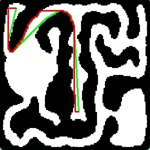

# florr-auto-farm

florr.io 的自动寻路 + 自动刷怪脚本。跑在你自己的电脑上:截图识别 + 模拟鼠标键盘,并通过 Chrome 的调试接口(CDP)往游戏页面注入脚本、读写页面里的数据(具体见下面「它对游戏页面做了什么」)。

> ⚠️ **风险声明**
> 游戏自动化脚本可能违反 florr.io 的服务条款,使用它有**账号被封**的风险。是否使用、后果如何,请自行判断、自行承担。本项目按 GPL-3.0 原样提供,不附带任何担保。



*绿线是本项目用的 Lazy Theta\*,红线是普通 A\*:前者需要的路径点少得多,能斜着直接切过去,走起来更直。*

## 它能做什么

- **自动寻路**:读小地图上你自己的黄色标记来定位,在仓库自带的地图(`maps/*.png`,事先做好的可走区域图)上用 Lazy Theta\* 规划路线,走到你指定的目标点。
- **刷怪**:到刷怪区后在区域内持续走动、不站桩。输出靠 florr 自带的「反转攻击键」——worker 每轮进游戏后会尝试把这个设置写好;写失败时日志里会提示,那就要你手动到 设置→控制 里勾上(见「已知限制」)。
- **识怪(沙漠图)**:解码游戏画面的绘制信息,读出怪物的位置、血量和稀有度,不需要任何模型文件。Mythic 及以上的怪会专门追击或走位,Ultra 里蝎子、甲虫这类判断打不过的会主动躲开;更普通的怪不专门去追,靠反转攻击键顺路打。
- **死亡与换服**:死了自动点继续、点开始、重新寻路;连续几轮没撑够刷怪时长,会试着换一台服务器(可在时块里关掉;换完之后落在哪个生态区没有确认过,见「已知限制」)。
- **AFK 弹窗**(仅 Windows,默认关闭):交给独立程序 [florr-auto-afk](https://github.com/greatluca666/florr-auto-afk) 处理(GPL-3.0,从上游 Shiny-Ladybug/florr-auto-afk 的 v1.1.1 分出,只加了自动开始检测)。它处理期间本程序自动暂停寻路。首次启用会询问是否下载(约 350MB)。
- **控制面板**:按「星期 + 时段」排时间表;每个时块选账号、地图、刷怪区;支持多账号,每个账号一个独立的 Chrome profile。
- **状态悬浮窗**:游戏画面角落显示当前在做什么、坐标、本状态已持续多久。

## 它对游戏页面做了什么(请知悉)

本程序不往游戏进程里注入 DLL,也不读取、不改写你和游戏服务器之间收发的消息内容。但它会通过 Chrome 的调试接口(CDP)对 florr.io 页面做下面这些事,**其中第 3、4 项会改动页面里的东西**:

1. 给 Canvas 2D 的绘制函数装**只读**钩子(每个被钩的调用都原样放行),记录最近几帧里的绘制调用(圆形填充、血条描边和文字),用来读出怪物、你自己和传送口的位置,以及怪物的血量和稀有度;另外包了一层 `requestAnimationFrame` 用来数帧;
2. 给 `WebSocket` 构造函数套一层**只读**代理,只为读出当前服务器的短码,收发的消息不动;
3. 每轮开局把「反转攻击键 / 反转防御键」这两个设置在页面 WASM 内存里的开关字节,**写**成你在时块里配置的值;
4. 换服务器时,调用游戏页面自己的 `cp6.forceServerID(...)` 函数,服务器编号取自 florr 公开的服务器列表接口(默认开启,可在时块里关掉);钩子装不上时,会限频(30 秒一次)刷新页面重试。

另外,新建账号、点账号页里已有账号的「登录」、以及调度器切换账号(包括点「开始调度」后进入第一个时块)时,程序会用 `taskkill /IM chrome.exe /F` **强制结束电脑上所有 Chrome 进程**,再重新拉起 Chrome——你别的 Chrome 窗口和没保存的标签页会丢,使用前先保存好。

程序拉起的 Chrome 会带上 `--remote-debugging-port` 和 `--remote-allow-origins=*` 参数,也就是本机开着一个调试端口、允许任意来源的网页连接它,所以别在这个 Chrome 里打开不信任的网站。

除此之外就是截图识别加模拟鼠标键盘。

## 下载与运行(Windows)

> **目前还没有发布 exe**(Windows 打包还没在真机上验证过),请先用下面的「从源码运行」。以下是有了 exe 之后的用法。

1. 需要 Windows 10/11 和 **Google Chrome**(程序靠它的调试接口读取页面、换服务器,Edge / Firefox 不行)。
2. 到 [Releases](../../releases) 下载最新的 `florr-auto-farm-vX.Y.Z-win64.zip`,把**整个文件夹**解压出来(别只拿出 exe,它要和 `_internal\` 放在一起)。解压路径别带中文,也别放在 OneDrive / 网盘同步目录里。
3. 双击 `florr-auto-pathing.exe` 打开控制面板。
4. 杀毒软件可能误报(PyInstaller 打包的程序常见),需要的话加白名单;不放心就从源码运行。

## 首次使用

1. 「账号」页 → 新建账号:会先关掉电脑上所有 Chrome 窗口(强制结束进程),再拉起一个全新的 Chrome 并打开 florr.io,在里面登录,回到面板点「完成」。账号存在 exe 旁边的 `chrome-profiles\<别名>\` 里。
2. 「时间表」页 → ＋ 新增时块:选星期、时段、账号、地图,在地图选择器里点出目标点和刷怪区。
3. 点 **▶ 开始调度**。之后它按时间表自动切账号、起停 worker,不需要再操作。

## 从源码运行

```bash
python -m venv venv
venv\Scripts\pip install -r requirements.txt     # macOS / Linux: venv/bin/pip
venv\Scripts\python main.py                      # macOS / Linux: venv/bin/python
```

在 Python 3.11 上测试过。

## 已知限制

- 坐标按 1920×1080 标定,程序启动时按屏幕分辨率自动缩放;非 16:9 的窗口可能有偏差。从源码运行时,可以用 `debug_screen_pos.py` 量按钮位置,再改 `utils.py` 里的常数。
- 稀有度文字按**中文客户端**实测,英文客户端没有验证过。
- 识怪目前只对沙漠图有意义。识怪之后的追击、躲避参数(Mythic / Ultra 相关)没有在真机上仔细调过,效果因人而异。
- 「反转攻击键 / 反转防御键」的内存地址是按某一个 florr 版本写死的,florr 大版本更新后可能失效;反转防御键的地址还没有二次核对。写失败时程序只在日志里提示、不会停下,这时需要你手动到 设置→控制 里勾上。
- 蚁穴地图要先进花园再踩洞口传送;传送点坐标是在一台 1920×1080 的机器上标定的,端到端没有经过验证。
- 主要在 Windows 上使用。macOS 和 Ubuntu(Xvfb 无头,见 `deploy/ubuntu/`)的代码路径存在,但没有在真机上长期验证。
- 自动换服会从 florr 服务器列表里随机挑一台与所选地图对应生态区的服务器(蚁穴对应花园),再调用页面自己的 `cp6.forceServerID` 触发重连。重连本身在真机上见过,但换过去之后落在哪个生态区没有确认过:早先试过用同一个函数在标题页切生态区,反复不行(会掉回花园,或被踢回标题页);换服之后程序也不会再点标题页的地图选择器(它在每个时块的 worker 启动后,第一次回到标题页时点一次)。所以换完可能不在沙漠图,寻路地图和实际所在地图会对不上。
- 时块里的「进游戏时换装 / 到刷怪区换装」(可选按住 k 或 l,再按数字键)没有在真机上验证过,默认关闭。
- 运行时它会接管鼠标和键盘、截屏读小地图,游戏要全屏放在最前面,这台电脑同时干不了别的。

## 量坐标的小工具

- `map_select.py`:在小地图上点一下,打印这个点的坐标。
- `area_select.py`:先点左上角、再点右下角,打印刷怪区域。
- `debug_screen_pos.py`:量游戏里按钮的屏幕坐标。
- `capture_map.py`:抓取地图图片。

## 自己打包

见 [PACKAGING.md](PACKAGING.md)。

## 许可证

GPL-3.0,见 [LICENSE](LICENSE)。本项目在 [Shiny-Ladybug/florr-auto-pathing](https://github.com/Shiny-Ladybug/florr-auto-pathing) 的基础上修改、扩充而来。
